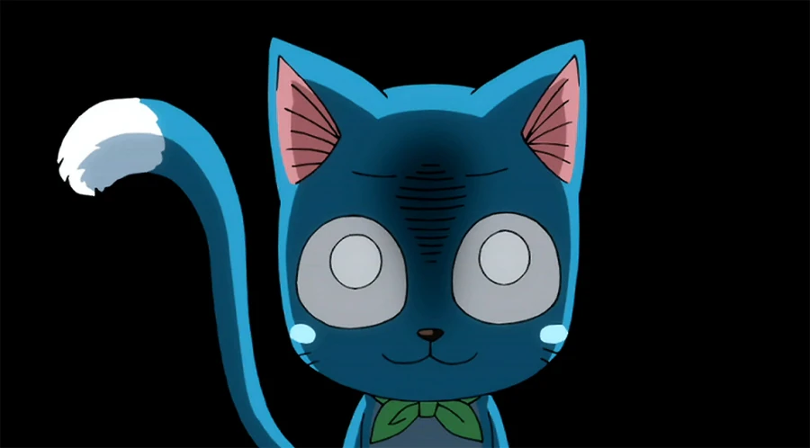

# Hi!

## About me

My name is Vlad, I'm 2nd year student in magnificent place - Moldova State University! 

## What I'm interested in

I really like some kind of old soft, 00s-10s geek culture, pokemons and windowsXP :3

## Programming languages

I kind of know:
- Python
- Java
- C++

I'm still learning:
- Java
- PHP

I'd like to learn if I had enough motivation:
- Rust
- Java Forge for minecraft modding ^^
- Lua

## Contacts

Feel free to message me anytime on Telegram @Ra192192 ;)
